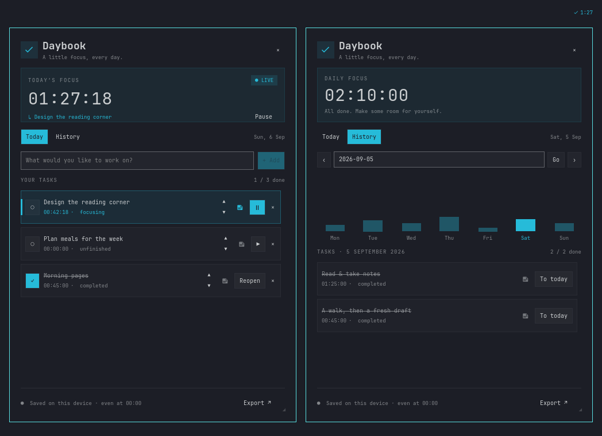

# Daybook Focus for Omarchy

A small task icon and today's total focus time in your top bar. Open it for a daily
to-do list, resumable timers, and a history of where your time went.



Native Quickshell UI · Live Omarchy themes · Local SQLite storage · MIT license

## Features

- Compact icon + `H:MM` bar display, always showing today's combined focus time.
- Start, pause, complete, and reopen tasks without resetting their recorded time.
- Save every task immediately, including unfinished tasks with zero time.
- Carry unfinished tasks into a new day while preserving each day's totals.
- Correct a recorded time by clicking it, on today or any past day.
- Keep a note on each task; the note icon lights up when there is one.
- Reorder tasks with the arrows so the important work sits at the top.
- Drag the corner to make the panel as tall or wide as your screen allows.
- Browse previous days, use the seven-day chart, and export all history as CSV.
- Use one shared timer across monitors; move the widget left, center, or right.
- Keep everything on your device. No accounts, network requests, or telemetry.

## Install

This is Shaun's fork of [ShahinMohamed/omarchy-daybook](https://github.com/ShahinMohamed/omarchy-daybook),
adding editable times, notes, reordering and a resizable panel.

Requires **Omarchy 4 / Quattro with its Quickshell shell** and **system Python 3**
with SQLite support (`/usr/bin/python3`). Git is used for installation and updates.
These are available on a standard Omarchy installation. No pip packages, separate
daemon setup, API keys, or system-wide configuration changes are needed.

From a terminal in your Omarchy desktop:

```bash
omarchy plugin add https://github.com/shaun-webdogs/omarchy-daybook --enable
```

Choose **left**, **center**, or **right** when prompted. The default placement is
right. Find it in Omarchy's bar widget picker as **Daybook Focus**, under **Time**.
Click the check icon next to the time to open your tasks.

Move it later using any one of these commands:

```bash
omarchy bar move shahin.daybook --section left
omarchy bar move shahin.daybook --section center
omarchy bar move shahin.daybook --section right
```

### Install from a local checkout

```bash
git clone https://github.com/shaun-webdogs/omarchy-daybook.git
cd omarchy-daybook
python3 install.py --section right
```

The local installer copies the runtime files into your user plugin directory,
validates them, backs up the bar configuration and any previous installation,
then enables the plugin. Choose `left`, `center`, or `right`. Local-copy installs
are updated by pulling this checkout and rerunning the installer; use the normal
`omarchy plugin add` installation above for Git-managed updates.

This plugin follows the [Omarchy plugin manifest contract](https://github.com/basecamp/omarchy/blob/quattro/shell/README.md).
Nothing needs to be built.

## Using Daybook

- Click the **check icon and time** in the bar. Type a task and press Enter or **+ Add**.
- Press **▶** to start. Starting another task pauses the previous one.
- **Ⅱ** pauses; **○** completes the task and saves its total.
- **Reopen** keeps the existing total. Press play to append more time.
- Double-click a task name to rename it; Enter saves and Escape cancels.
- Click a task's time to correct it. Type `1:30`, `1:30:00`, `1h30m`, `45m`, or a bare
  number of minutes; Enter saves and Escape cancels. This works in History too, so
  a forgotten timer can be fixed on the day it belongs to.
- **󰎞** opens a note under the task. Ctrl+Enter or **Save** stores it, Escape closes
  without saving, and clicking elsewhere saves any change. The icon turns accent
  when a note exists; hover it to read the note without opening it.
- **▲ ▼** move a task one place; right-click them to send it to the top or bottom.
  Open and completed tasks keep their own order.
- Drag the **◢** corner to resize the panel. The size is remembered on every
  monitor; double-click the corner to go back to the default.
- **×** beside a task archives it without deleting any history.
- **History** shows each day's tasks and exact time, including unfinished tasks
  with zero time. Use the arrows, enter a date, or click a bar in the seven-day chart.
- **To today** brings an old or archived task back, without changing past days.
- **Export ↗** saves all daily records as a CSV. The saved file path is shown in the panel.
- Escape or an outside click closes the panel. Timers continue while it is closed.
- Right-click the bar widget to pause the active timer.

The bar shows hours and minutes (for example, `1:34`) using Omarchy's small text
size. It never expands to show task names or second-by-second time. Hover to see
the exact daily total and active task; the panel shows every task as `HH:MM:SS`.

Open from a shortcut or terminal:

```bash
omarchy-shell shell toggle shahin.daybook
```

## How your days are saved

Creating a task immediately writes a durable zero-time entry. Every operation is a
SQLite transaction, and the running timer checkpoints every second. Completing,
pausing, and archiving flush the time first. Reopening never resets elapsed time.
At midnight a running interval is split across local calendar dates. Unfinished
tasks carry forward with a fresh daily total, including days while the shell was
off. Completed and archived tasks stay in history until brought back explicitly.
Renaming changes today's entry and future days; previous titles stay intact.
Editing a time replaces that day's total for the task; a running timer keeps counting
from the new value. Notes and task order live on the task itself, not on a day.

On a shell restart, reload or reboot, a running task is paused at the last saved
checkpoint. Offline time is not added; click play to continue. After sleep or a
clock jump (a gap longer than 15 seconds, or a backwards clock), the timer pauses.
A sudden power loss can lose at most the time since the last successful checkpoint,
normally one second. The panel reports service or save errors rather than marking
an unconfirmed change as saved.

One shared service owns the timer across all monitors. There is no network,
account, telemetry, or dependency on the panel staying open.

Data lives at:

```text
~/.local/share/omarchy-daybook/daybook.sqlite3
~/.local/share/omarchy-daybook/exports/
```

`XDG_DATA_HOME` is respected when set. Task data is kept outside the plugin folder,
so updating or removing the plugin leaves your history in place. SQLite uses WAL;
use SQLite's backup API or stop the plugin before copying the database by hand.
CSV exports contain every task/day, status, and time with millisecond precision.

You can export to standard output without interrupting a live timer:

```bash
python3 ~/.config/omarchy/plugins/shahin.daybook/daybook.py --export
```

## Update, disable, or remove

For installations made with `omarchy plugin add`:

```bash
omarchy plugin update shahin.daybook
```

Disable or re-enable without losing any history:

```bash
omarchy plugin disable shahin.daybook
omarchy plugin enable shahin.daybook --section right
```

Remove the installed plugin:

```bash
omarchy plugin remove shahin.daybook
```

Removal keeps your task database and CSV exports. Installing it again restores
access to that history. Do not remove `~/.local/share/omarchy-daybook/` unless you
intend to discard your saved data.

## Development and verification

```bash
python3 -B -m unittest discover -s tests -v
python3 -B tests/check_ui.py
omarchy plugin validate .
```

`daybook.py` is a Python standard-library service. Its stdin/stdout protocol is
newline-delimited JSON; state updates and action acknowledgements are emitted on
stdout. SQL uses bound parameters, writes use transactions, one process holds an
exclusive writer lock, and task names render as plain text.

Local installation backups are under `~/.config/omarchy/plugin-backups/shahin.daybook/`.
No packaged files in `/usr/share/omarchy/` are modified.

The preview uses fictional tasks. Regenerate it with `python3 -B tests/render_preview.py`.

## License

[MIT](LICENSE), copyright Shahin. The plugin and preview fixtures are included in
this repository; no third-party images or fonts are bundled. The UI uses Omarchy's
installed theme and font.
